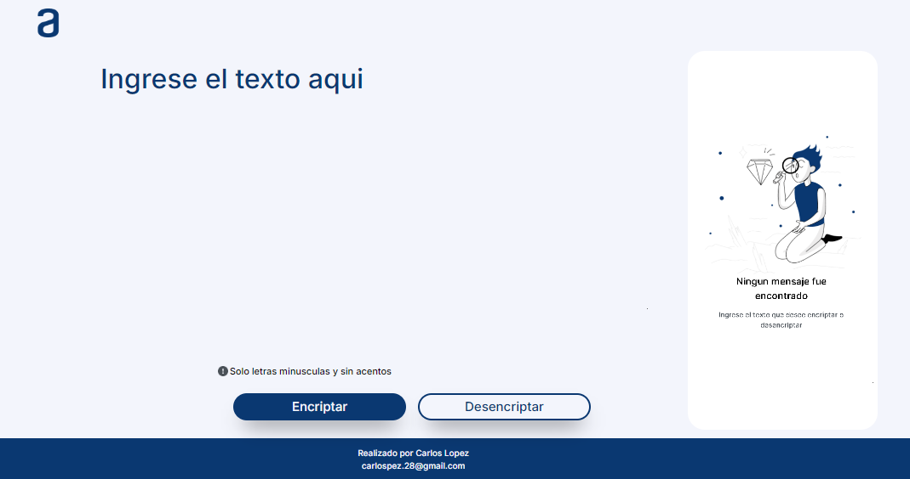
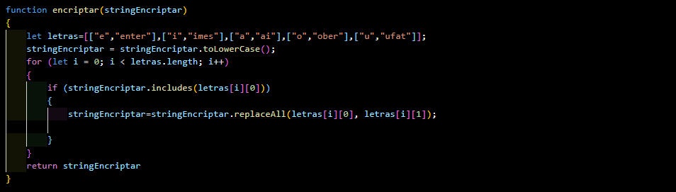

# Encriptador de texto

### Realizado por:
- Carlos Lopez 
- Correo electronico carlospez.28@gmail.com

### Descripción
Este es un programa que permite encriptar y desencriptar el texto, el mismo se realizo utilizando Html, Css, Javascript.

## Función principal
La función encriptar reemplaza las vocales de un texto con secuencias de letras predefinidas para "encriptar" el mensaje.

Mapeo de vocales:

- Se define un conjunto de reemplazos para cada vocal (por ejemplo, "e" por "enter").

Conversión a minúsculas:

- El texto se convierte a minúsculas para evitar problemas de coincidencia.

Reemplazo de vocales:

- Se recorre el texto, buscando cada vocal y reemplazándola por la secuencia definida.

Resultado:

- Se devuelve el texto encriptado.

Ejemplo:

- Texto original: "hola mundo"

- Resultado encriptado: "hoberlai mundober"

La función encriptar es útil para realizar una transformación sencilla de un texto, reemplazando vocales con secuencias predefinidas. Esto podría aplicarse en situaciones donde se necesite una forma básica de ocultar un mensaje.

## Link de la aplicacion desplegada
https://carlosgithub1506.github.io/web-encriptador-texto/

## Qr de la aplicacion desplegada

## Link del proyecto
- [Proyecto](https://github.com/carlosgithub1506/web-encriptador-texto)

## Link del video
- [Video](https://youtu.be/OiKbu5a8D8k)

## Contacto
- Correo electronico carlospez.28@gmail.com

